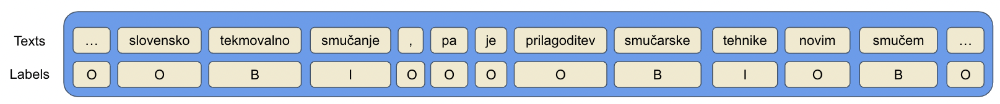

# A Transformer-based Sequence-labeling Approach to the Slovenian Cross-domain Automatic Term Extraction

## 1. Description

In this repo, we experiment  XLM-RoBERTa on  RSDO5 dataset to evaluate the performance of multilingual pretrained language models in the cross-domain sequence-labeling setting of automatic term extraction (ATE) and compare our models' performance towards the benchmarks.

## 2. Requirements

Please install all the necessary libraries noted in [requirements.txt](./requirements.txt) using this command:

```
pip install -r requirements.txt
```

## 3. Data

The experiments were conducted on RSDO5 dataset, which is a collection of 12 documents with altogether about 250,000 words from the Slovenian language. The dataset is available at [RSDO5 1.1](https://www.clarin.si/repository/xmlui/handle/11356/1470) and contains the following domains:

|| RSDO5 dataset|
|:-:|:-:|
|Languages|Slovenian|
|Domains|Biomechanics, Chemistry, Veterinary, Linguistics |

## 4. Implementation

As the orginal dataset does not follow IOB format, we preprocess the data to sequentially map each token with it regarding label. An example of IOB format is demontrated below.



For ACTER dataset, run the following command to preprocess the data:

```python
preprocess.py [-corpus_path] [-term_path] [-output_csv_path] [-language]
```

where `-corpus_path` is the path to the directory containing the corpus files, `-term_path` is the path to the directory containing the term files, `-output_csv_path` is the path to the output csv file, and `-language` is the language of the corpus.

For RSDO5 dataset, the dataset is already in conll format. Please use `read_conll()` function in `preprocess.py` to get the mapping.

Run the following command to train the model with all the scenarios in  RSDSO5 datasets:

```python
run.sh
```

where `run.sh` covers the 12 scenarios regarding 12 combination of train-valid-test splits with two domains of training, one domains of validation and one domains of testing.

Feel free to hyper-parameter tune the model. The current settings are:

```python
    num_train_epochs=20,             # total # of training epochs
    per_device_train_batch_size=32,  # batch size per device during training
    per_device_eval_batch_size=32,   # batch size for evaluation 
    learning_rate=2e-5,              # learning rate
    eval_steps = 500,
    load_best_model_at_end=True,     # load the best model at the end of training
    metric_for_best_model="f1",
    greater_is_better=True,
```

## 5. Results

### 5.1 XLM-RoBERTa in mono-lingual settings

<center>
<table>
<tr><th>Test = ling </th><th>Test = vet</th></tr></tr>
<tr><td>

|Validation     |Test   | F1-score    |
| :-: | :-: | :-: |
|vet    |ling   | 66.69  |
|bim    |ling   | 71.51  |
|kem    |ling   | 69.15  |

</td><td>

|Validation     |Test   | F1-score    |
| :-: | :-: | :-: |
|ling   |vet    | 68.82 |
|kem    |vet    | 68.94  |
|bim    |vet    | 68.68  |

</td></tr> </table>
</center>

<center>
<table>
<tr><th>Test = kem </th><th>Test = bim</th></tr></tr>
<tr><td>

|Validation     |Test   | F1-score    |
| :-: | :-: | :-: | 
|ling   |kem    |61.16 |
|bim    |kem    |64.83  |
|vet    |kem    |64.27  |

</td><td>

|Validation     |Test   | F1-score    |
| :-: | :-: | :-: | 
|vet    |bim    |65.11  |
|ling   |bim    |63.69  |
|kem    |bim    |63.16  |

</td></tr> </table>
</center>

### 5.2 Comparison with benchmark
<center>
<table>
<tr><th>Test = ling </th><th>Test = vet</th></tr></tr>
<tr><td>

|Methods   | F1-score    |
| :-: | :-: |
|vet    | 34.10  |
|bim    | 71.51 |

</td><td>

|Methods   | F1-score    |
| :-: | :-: |
|vet    | 29.90  |
|bim    | 68.94  |

</td></tr> </table>
</center>

<center>
<table>
<tr><th>Test = kem </th><th>Test = bim</th></tr></tr>
<tr><td>

|Methods   | F1-score    |
| :-: | :-: |
|vet    | 37.80  |
|bim    | 64.83  |

</td><td>


|Methods   | F1-score    |
| :-: | :-: |
|vet    | 33.90  |
|bim    | 65.11  |

</td></tr> </table>
</center>

## Contributors:
- 🐮 [TRAN Thi Hong Hanh](https://github.com/honghanhh) 🐮
- [Matej MARTINC](https://github.com/matejMartinc)
- [Andraz Repar]()
- Prof. [Senja POLLAK](https://github.com/senjapollak)
- Prof. [Antoine DOUCET](https://github.com/antoinedoucet)
